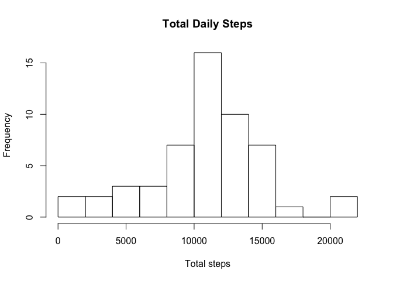
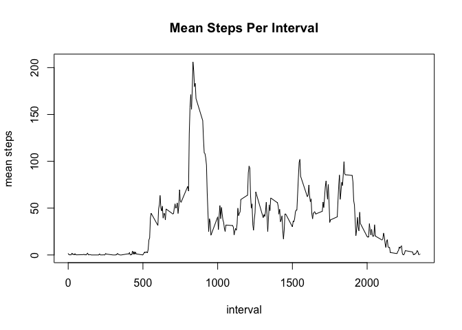
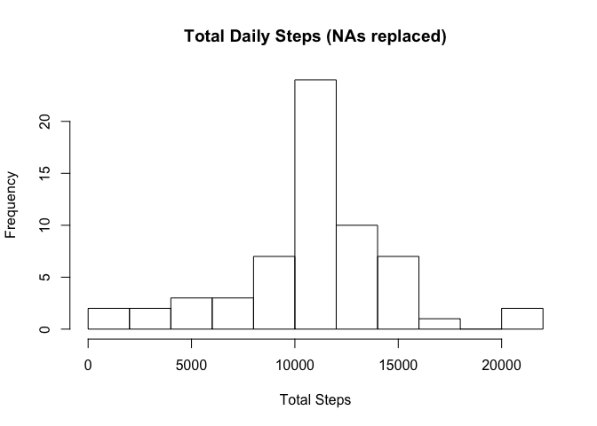
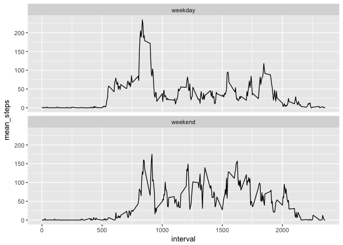

## Loading and preprocessing the data

```r
setwd("~/Documents/Coursera code/Reproducible_data/RepData_PeerAssessment1-master/")
unzip("./activity.zip")
movedata <- read.csv("./activity.csv")
movedata$date <- as.Date(movedata$date)
```

## What is mean total number of steps taken per day?
Here is a histogram showing the total number of steps per day

```r
library(dplyr)
# calculate and plot total steps per day
dailysteps <- movedata %>% 
        filter(!is.na(steps)) %>%
        group_by(date) %>% 
        summarise(total_steps = sum(steps))
hist(dailysteps$total_steps, breaks = 10, main = "Total Daily Steps", xlab = "Total steps")
```

<!-- -->

## What is the average daily activity pattern?


```r
#calculate mean and median steps per day
mean_steps <- mean(dailysteps$total_steps, na.rm = TRUE)
median_steps <- median(dailysteps$total_steps, na.rm = TRUE)
```
The mean number of steps per day is 1.0766189\times 10^{4}.  
The median number of steps per day is 10765.


```r
#calculate mean steps per interval and identify which interval has the highest average
intervalsteps <- movedata %>% 
        filter(!is.na(steps)) %>% 
        group_by(interval) %>% 
        summarise(mean_steps = mean(steps, na.rm = TRUE))
plot(intervalsteps, type = "l", main = "Mean Steps Per Interval", ylab = "mean steps")
```

<!-- -->

```r
max_int <- intervalsteps$interval[which.max(intervalsteps$mean_steps)]
```
The 5 minute interval with the greatest average number of steps is 835.


## Imputing missing values

```r
# Calculate number of NAs
nas <- sum(is.na(movedata$steps))
```
There are 2304 NAs in the steps dataset  
NAs will be replaced with the average number of steps for the interval

Here is a plot showing the daily number of steps with the imputed NAs in the dataset

```r
# Replace NAs with mean steps for that interval and plot histogram
nasreplaced <- movedata
for(i in 1:length(nasreplaced$steps)) {
        if (is.na(nasreplaced$steps[i])) {
        interval <- nasreplaced$interval[i]
        avgsteps <- intervalsteps[intervalsteps$interval == interval, 2]
        nasreplaced$steps[i] <- avgsteps
        }
}
nasreplaced$steps <- unlist(nasreplaced$steps)

dailynasrep <- nasreplaced %>% group_by(date) %>% summarise(total_steps = sum(steps))
mean_steps_narep <- mean(dailynasrep$total_steps)
median_steps_narep <- median(dailynasrep$total_steps)

mean_diff <- mean_steps - mean_steps_narep 
median_diff <- median_steps_narep - median_steps

hist(dailynasrep$total_steps, breaks = 10, main= "Total Daily Steps (NAs replaced)", xlab = "Total Steps")
```

<!-- -->

The mean number of steps per day for the updated dataset with imputed NA values is 1.0766189\times 10^{4}, a difference of 0 steps compared to the original dataset 

The median number of steps per day for the updated dataset with imputed NA values is 1.0766189\times 10^{4}, a difference of 1.1886792 steps compared to the original dataset

*Imputing NA values using this strategy does not significantly affect the overall mean and median daily step totals*

## Are there differences in activity patterns between weekdays and weekends?
Here is a plot showing the average steps per interval for weekdays and weekends

```r
# create weekday/weekend column and plot average steps per interval for weekdays and weekends
library(ggplot2)

movedata$weekday <- weekdays(movedata$date)

for(i in 1:length(movedata$weekday)){
        if(movedata$weekday[i] == "Saturday" | movedata$weekday[i] == "Sunday") {
        movedata$weekday[i] <- "weekend"
} else {
        movedata$weekday[i] <- "weekday"
}
}

intervalsteps_weekday <- movedata %>% 
        filter(!is.na(steps)) %>% 
        group_by(interval, weekday) %>% 
        summarise(mean_steps = mean(steps, na.rm = TRUE))

ggplot(intervalsteps_weekday, aes(interval, mean_steps)) + 
               geom_line() +
               facet_wrap(~ weekday, nrow = 2)
```

<!-- -->
        
